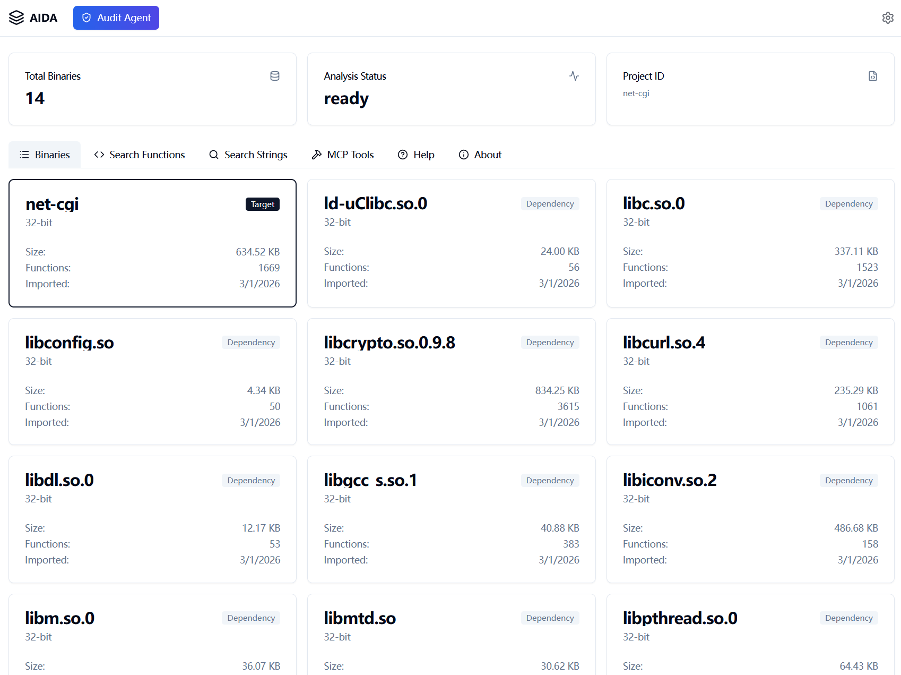
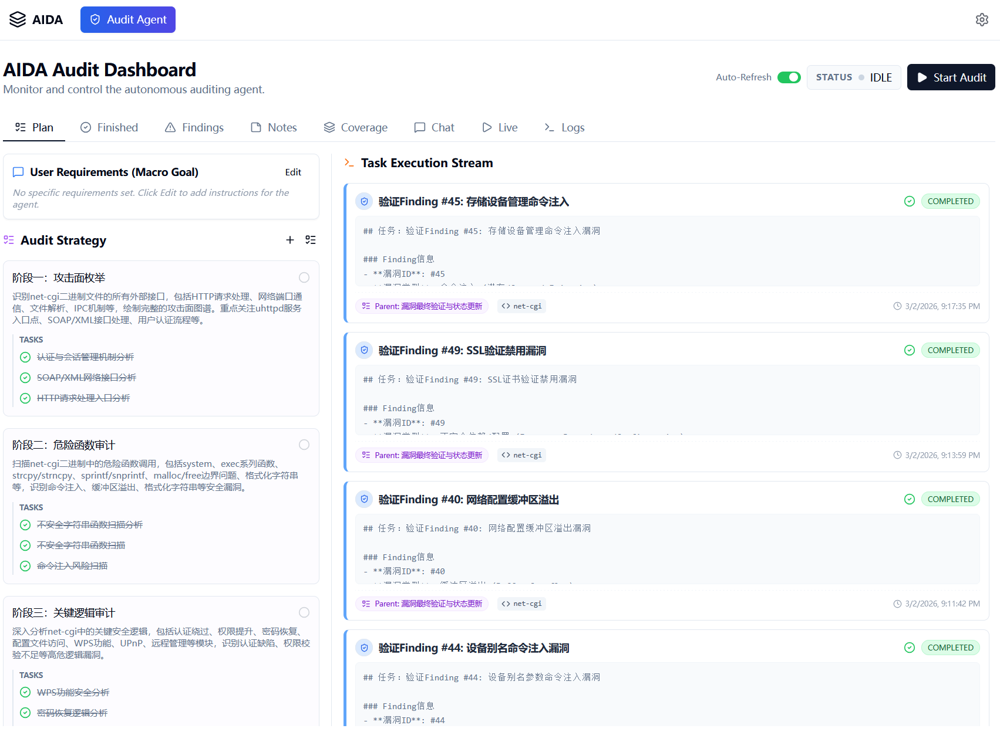

# AIDA-AUDIT

AIDA-AUDIT is a powerful tool designed to bridge the gap between IDA Pro binary analysis and modern AI-assisted workflows. It provides a seamless way to export analysis data from IDA Pro and explore it through a rich Web UI or programmatically via the Model Context Protocol (MCP).

## Screenshots

### Web UI


### Automated Audit


## Features

*   **Export**: Automated extraction of binary metadata (functions, strings, imports, exports, pseudocode, etc.) from IDA Pro or Ghidra into portable SQLite databases. Automatically initializes the workspace with MCP client configurations.
*   **Web UI**: A modern, interactive web interface to browse and analyze the exported data.
*   **MCP Server**: A fully compliant Model Context Protocol server that allows AI assistants to query and reason about the binary structure.
*   **Automated Code Audit**: An intelligent agent system powered by LLM that automatically plans, executes, and verifies security audits on binaries, with real-time feedback and detailed reporting.
*   **REST API**: A FastAPI-backed backend for custom integrations.

## Installation

### Prerequisites

*   **Python 3.9+**
*   **IDA Pro**: Required for the `aida-audit export` command with IDA backend.
*   **Ghidra**: Required when exporting with the Ghidra backend.
*   **JDK**: Required for running Ghidra (skip if your Ghidra bundle includes a JDK).
*   **Node.js**: Required only if you plan to build the frontend from source (optional).

### Install IDA Pro lib (Required)

To make the `aida-audit export` command work properly with the IDA backend, you need to install the IDA Pro Python library.

1.  Ensure IDA Pro is installed and the environment is configured.
2.  Navigate to the `idalib/python` subdirectory under your IDA Pro installation directory (e.g., `C:\Program Files\IDA Professional 9.2\`).
3.  In this directory, you should find an `idapro` folder, along with `setup.py` and `py-activate-lidalib.py` files.
4.  Run the following command in this directory:
    ```bash
    pip install .
    ```
5.  After installation, run `python py-activate-lidalib.py` to activate the IDA Pro Python library.

### Install Node.js (Optional)

If you plan to build and install `aida-audit` from source, you need to install Node.js.

1.  Download and install the latest version of Node.js.
2.  Verify the installation:
    ```bash
    node -v
    npm -v
    ```

### Install Ghidra and JDK (Required for the Ghidra backend)

1.  Install a JDK (if your Ghidra bundle does not include one).
2.  Download and extract Ghidra.
3.  Set `GHIDRA_HOME` to the Ghidra root directory (it must contain `support/analyzeHeadless(.bat)`).
4.  Verify the path:
    ```bash
    # Windows
    %GHIDRA_HOME%\support\analyzeHeadless.bat
    # Linux/macOS
    $GHIDRA_HOME/support/analyzeHeadless
    ```

### Source Build & Install

We provide scripts to automatically build the frontend, package the backend, and install the tool into your Python environment.

1.  Navigate to the `backend` directory:
    ```powershell
    cd backend
    ```
2.  For Windows, run the build and install script:
    ```powershell
    .\build_and_install.ps1
    ```
    For Linux/MacOS, run the build and install script:
    ```bash
    ./build_and_install.sh
    ```

This script will automatically:
*   Build the React frontend.
*   Copy the frontend assets to the backend package.
*   Copy the built-in skills into the backend package.
*   Build the Python wheel.
*   Install `aida-audit` using `pip`.

### PIP Installation

If you only need the backend or want to install from a pre-built wheel:

```bash
pip install aida-audit
```

## Usage

Once installed, the `aida-audit` command is available in your terminal.

### 1. Export Analysis Data (`export`)

The `export` command runs a headless IDA Pro or Ghidra instance to analyze a binary and save the results. It automatically initializes the workspace with MCP client configurations.

```bash
aida-audit export <target_binary> -o <output_directory>
```

**Arguments:**
*   `<target_binary>`: Path to the target binary file (e.g., `.exe`, `.so`, firmware component).
*   `-o, --out-dir`: Directory where the SQLite database (`.db`) and other artifacts will be saved.

**Advanced Options:**
*   `-s, --scan-dir <dir>`: **Bulk Mode**. Recursively scans the specified directory for dependencies (useful for analyzing firmware file systems).
*   `-j <n>`: Number of parallel workers (default: 4).
*   `--backend <ida|ghidra>`: Choose the export backend (default: `ida`).
*   `--verbose`: Enable detailed logging.
*   `--log-file <path>`: Write logs to a file.
*   When `--backend ghidra` is used, set `GHIDRA_HOME` in your environment before running.

**Workspace Initialization:**
The export command automatically creates the following in the output directory:
*   `opencode.json`: OpenCode project config with MCP servers.
*   `.mcp.json`: MCP client configuration.
*   `.trae/mcp.json`: Trae client MCP configuration.
*   `.claude/settings.local.json`: Claude desktop settings.
*   `.opencode/skills/`: OpenCode-compatible skills (if available).

**Example:**
```bash
# Analyze a single binary
aida-audit export ./bin/httpd -o ./output

# Analyze a binary within a firmware root, resolving dependencies
aida-audit export ./squashfs-root/usr/sbin/httpd -o ./output --scan-dir ./squashfs-root

# Export with the Ghidra backend (using GHIDRA_HOME)
aida-audit export ./bin/httpd -o ./output --backend ghidra

# Export multiple targets via wildcard
aida-audit export ./lib/uams/uams_* -o ./output
```

### 2. Start the Server (`serve`)

The `serve` command launches the Web UI and the MCP server.

```bash
aida-audit serve [project_path]
```

**Arguments:**
*   `[project_path]`: Path to the directory containing exported `.db` files. Defaults to the current directory (`.`).

**Options:**
*   `--host`: Host address to bind to (default: `127.0.0.1`).
*   `--port`: Port number (default: `8765`).

**Accessing the UI:**
Once the server is running, open your browser and navigate to:
**http://localhost:8765**

**MCP Server Address:**
**http://localhost:8765/mcp**

## Automated Code Audit

AIDA-AUDIT includes a sophisticated intelligent agent system designed to automate the security audit process. This system leverages Large Language Models (LLMs) and the Model Context Protocol (MCP) to perform in-depth analysis of binaries.

### Key Capabilities

*   **Intelligent Planning**: The `PlanAgent` analyzes the target binary's structure and creates a comprehensive, high-level audit plan tailored to the specific characteristics of the code.
*   **Autonomous Execution**: The `AuditAgent` executes the plan by decomposing it into specific tasks. It utilizes a rich set of tools to explore code, analyze control flow, and identify potential vulnerabilities.
*   **Verification & Validation**: A dedicated `VerificationAgent` reviews the findings to minimize false positives and ensure the accuracy of the report.
*   **Real-time Dashboard**: Monitor the agent's thought process, tool usage, and findings in real-time through the "Live" tab in the Web UI.
*   **Loop Detection**: Advanced loop detection mechanisms prevent the agent from getting stuck in repetitive analysis cycles.
*   **Bilingual Reporting**: Supports generating reports and findings in both English and Chinese.

### How it Works

1.  **Initialization**: When you start an audit session, the system initializes the agents and loads the necessary context from the exported database.
2.  **Planning Phase**: The planner agent surveys the binary's functions, strings, and imports to outline a strategy.
3.  **Audit Loop**: The audit agent picks up tasks from the plan, uses tools (like `audit_report_finding`, `audit_create_note`) to document its work, and updates the task status.
4.  **Completion**: Once all tasks are completed or the user stops the session, a final report is generated.

## Development

### Directory Structure
*   `backend/`: Python source code (FastAPI, IDA scripts, MCP implementation).
*   `frontend/`: React/TypeScript source code for the Web UI.
*   `devdocs/`: Design documentation and API specifications.

### Running in Development Mode
1.  **Backend**: `cd backend && uvicorn aida-audit.server_cmd:app --reload`
2.  **Frontend**: `cd frontend && npm run dev`